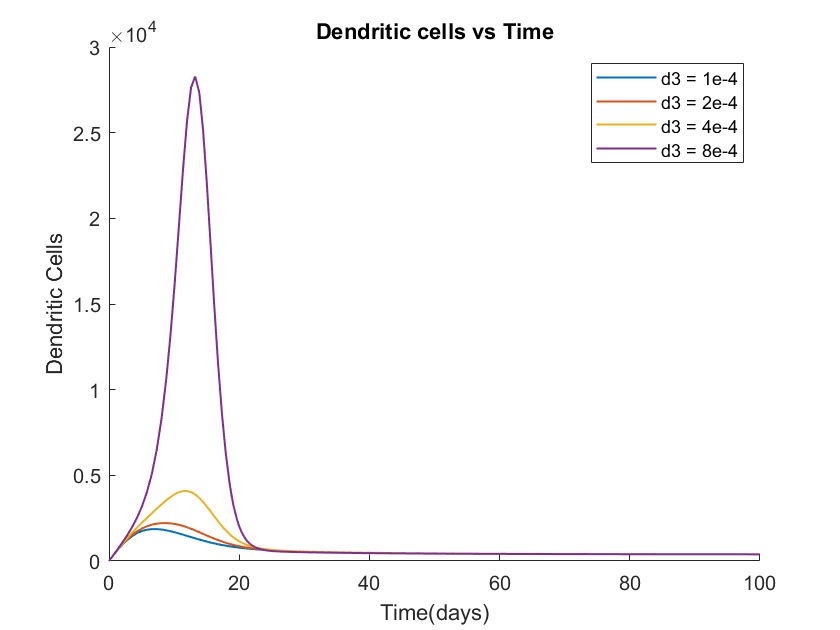
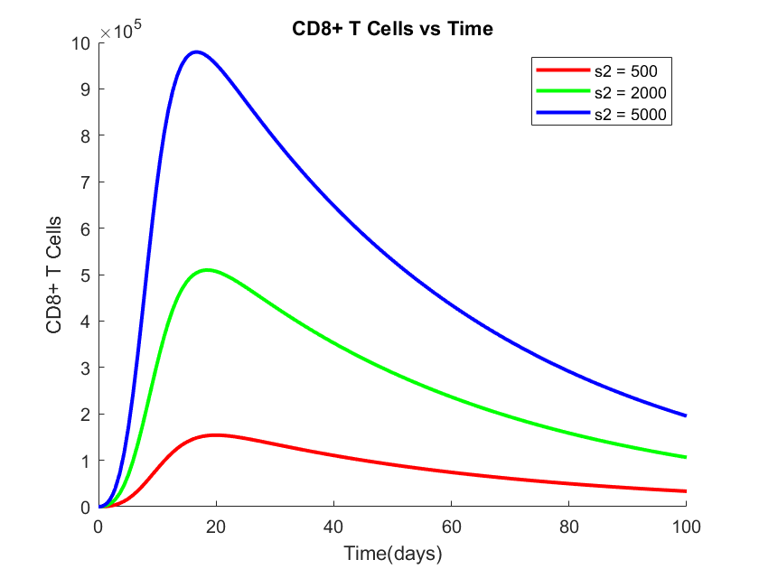

# Model Replication

## Unni & Seshaiyer (2019)

## Purpose of This Page

This page presents the replication of key simulation results from _Mathematical Modeling, Analysis, and Simulation of Tumor Growth with Drug Interventions_ by Unni & Seshaiyer (2019). While our **theoretical modeling is based on Sharma (2022)**, the simulation graphs in that paper were incomplete regarding equations and parameters. Therefore, we used Unni & Seshaiyer’s fully specified ODE model to replicate meaningful biological simulations.

---

## System of ODEs Used

The model simulates the interaction between:
tumor cells, natural killer (NK) cells, dendritic cells, CD8+ T-cells, and drug interventions.

### Parameter definitions

---

- \( T(t) \): Tumor size at time \( t \)
- \( N(t) \): Number of natural killer cells
- \( D(t) \): Number of dendritic cells cells
- \( L(t) \): Number of cytotoxic CD8+ Tcells cells

---

- \( K_T \): How much the chemo drug harms Tumor cells
- \( K_N \): How much the chemo drug harms NK cells
- \( K_D \): How much the chemo drug harms dendritic cells
- \( K_L \): How much the chemo drug harms CD8+ T-cells

---

- \( a \): tumor growth rate
- \( b \): tumor-carrying capacity
- \( c_1 \): NK cell tumor cell kill rat
- \( c_2 \): NK cell inactivation rate by tumor cells
- \( d_1 \): rate of dendritic cell priming(activate) NK cells
- \( d_2 \): NK cell dendritic cell kill rate
- \( d_3 \): rate of tumor cells priming dendritic cells
- \( e \): death rate of NK cell estimated
- \( f_1 \): CD8+ T cell dendritic cells kill rate
- \( f_2 \): rate of dendritic cells priming CD8+ T cell
- \( g \): death rate of dendritic cells
- \( h \): CD8+ T inactivation rate by tumor cells
- \( i \): death rate of CD8+ T cells
- \( j \): dendritic cell tumor cell kill rate
- \( k \): NK cell tumor cell kill rate
- \( s_1 \): source of NK cells
- \( s_2 \): source of dendritic cell
- \( u \): regulatory function by Nk cells of CD8+ T cells

---

The relevant system of equations are:

---

# Models of Key Populations

---

## 1. Tumor Cells

_abnormal cells that divide and grow uncontrollably, forming a mass of tissue known as a tumor_

\[
\frac{dT}{dt} = aT(1 - bT) - (c_1 N + jD + kL)T - K_T z(M)T
\]

---

- \( aT(1 - bT) \): Logistic growth (natural tumor proliferation with carrying capacity).
- \( - (c₁N + jD + kL)T \): Loss due to interactions with NK cells, dendritic cells, and T-cells.
- \( - K_T z(M)T \): Tumor cell death due to chemotherapy, with a nonlinear kill term \( z(M) = 1 - e^{-M} \)

---

## 2. Natural Killer (NK) Cells

_white blood cells that destroy infected cells and cancer cells in your body_

\[
\frac{dN}{dt} = s_1 + \frac{g_1 N T^2}{h_1 + T^2} - (c_2 T + d_1 D)N - K_N z(M)N - eN
\]

---

- \( s_1 \): Constant source of NK cells.
- \( \frac{g_1 N T^2}{h_1 + T^2} \): NK cell recruitment via a Michaelis–Menten-like function.
- \( (c_2 T + d_1 D)N \): loss due to competition with tumor cells and dendritic cells
- \( K_N z(M)N \): loss due to chemotherapy drug
- \( eN \): Natural death of NK cells

---

## 3. Dendritic Cells

_A special type of immune cell that is found in tissues, such as the skin, and boosts immune responses by showing antigens on its surface to other cells of the immune system_

\[
\frac{dD}{dt} = s_2 - (f_1 L - d_2 N + d_3 T)D - K_D z(M)D - gD
\]

---

- \( s_2 \): Constant source of dendritic cells.
- \( (f_1 L - d_2 N + d_3 T)D \): loss due to competition with Nk and CD8+ cells. \( d_3T \) rather activates dendritic cells
- \( K_D z(M)D \): loss due to chemotherapy drug
- \( gD \): Natural death of dendritic cells

---

## 4. CD8+ T-Cells

_a type of white blood cell that plays a crucial role in the immune system by directly killing infected cells and cancerous cells._

\[
\frac{dL}{dt} = f_2 D T - h L T - u N L^2 + r_1 N T + \frac{p_I I L}{g_I + I} - K_L z(M) L - iL + v_L(t)
\]

---

- \( f_2DT \): Activated by Dendritic-Tumor interaction.
- \( -hLT \): Competition between CD8+ T cells and tumor cells
- \( -uNL^2 \): describes regulation and suppression of CD8+ T-cell activity when there are high levels of activated CD8+ T-cells without responsiveness to cytokines in the system.
- \( r₁NT \): recruitment term proportional to the number of cells killed
- \( \frac{p_I I L}{g_I + I} \): Immune activation by immunotherapy drug.
- \( K_L z(M) L \): loss due to chemotherapy drug
- \( iL \): Natural death of CD8+ T-cells
- \( v_L(t) \): External T-cell infusion (e.g. TIL therapy).

---

## Treatments

---

### 1. Chemotherapy Drug

\[
\frac{dM}{dt} = v_M(t) - d_4 M
\]

- \( v_M(t) \) : Chemotherapy drug dosage over time
- \( d_4 M \) : Natural clearance from the bloodstream.

---

### 2. Immunotherapy Drug

\[
\frac{dI}{dt} = v_I(t) - d_5 I
\]

Where the nonlinear chemotherapy kill function is defined as:

\[
z(M) = 1 - e^{-M}
\]

The primary simulation variable explored is \( s_2 \), the dendritic cell source term.

- \( v_I(t) \): Immunotherapy drug dosage.
- \( d_5 I \): Natural clearance from the bloodstream.

---

# Varying \(d_3 \)

_\( d_3\) is the rate of tumor cells priming dendritic cells_

### Assumptions

1. There are not recruitment terms for CD8+ T cells and NK cells ie **\((r_1 = g_1 = h_1 = 0)\)**
2. remove all the supression, regulation and activation of CD8+ T cells ie **\((p_I = g_I = u = 0)\)**
3. There is not influence of drugs/vaccine on cell populations ie **\((K_T = K_N = K_D = K_L = v_L = v_M = v_I = 0)\)**
4. Weak immune system with initial conditions of _100 tumor cells, 1 natural killer cell, 1 dendritic cell, 1 CD8+ T cell_

---

## 1. Tumor Cells

  <a href="../code.html#effect-of-varying-d_3-on-tumor-cells" class="btn btn-primary" role="button">See code</a>

Increasing d3 appears to lead to a more rapid initial decrease in tumour cell numbers and potentially a lower overall tumour burden in the long term

## 2. Natural killer (NK) Cells

  <a href="../code.html#effect-of-varying-d_3-on-Natural-Killer-cells" class="btn btn-primary" role="button">See code</a>

The dynamics of NK cells seem to be affected, showing a more pronounced initial increase as d3 increases

## 3. Dendritic Cells

  <a href="../code.html#effect-of-varying-d_3-on-dendritic-cells" class="btn btn-primary" role="button">See code</a>

As expected, increasing the proliferation rate of dendritic cells due to tumour cells (d3) results in a higher number of dendritic cells

## 4. Cytotoxic (CD8+) Cells

  <a href="../code.html#effect-of-varying-d_3-on-cd8-t-cells" class="btn btn-primary" role="button">See code</a>

The number of CD8+ T cells also appears to increase with higher values of d3, suggesting a stronger adaptive immune response

---

# Varying \(s_2 \)

_\( s_2\) is the source of dendritic cells_

### Assumptions

_same as above_

---

## 1. Tumor Cells

  <a href="../code.html#effect-of-varying-s_2-on-tumor-cells" class="btn btn-primary" role="button">See code</a>

As \( s_2 \) increases, dendritic activation enhances the immune response, leading to progressive tumor suppression. For \( s_2 = 5000 \), the tumor shrinks significantly compared to baseline.

## 2. Natural killer (NK) Cells

  <a href="../code.html#effect-of-varying-s_2-on-natural-killer-cells" class="btn btn-primary" role="button">See code</a>

NK cell population initially spikes in all cases, but higher \( s_2 \) supports more sustained NK activity, likely due to indirect immune stimulation.

## 3. Dendritic Cells

  <a href="../code.html#effect-of-varying-s_2-on-dendritic-cells" class="btn btn-primary" role="button">See code</a>

T-cell activation increases significantly with higher dendritic cell source. This is consistent with the role of dendritic cells in activating adaptive immunity.

## 4. Cytotoxic (CD8+) Cells

  <a href="../code.html#effect-of-varying-s_2-on-cytotoxic-cells" class="btn btn-primary" role="button">See code</a>

As expected, higher \( s_2 \) directly results in greater dendritic cell population. However, immune feedback mechanisms influence the trajectory.

---

### insights

These results confirm that dendritic cell influx (\( s_2 \)) has a cascading effect on the immune system’s ability to control tumor growth. Increasing \( s_2 \) boosts dendritic, NK, and CD8+ T-cell populations, leading to improved tumor suppression. This reinforces the value of dendritic cell-based immunotherapy strategies in clinical settings.

---

---

_Note: All models and simulations in this section are based on the equations from Unni & Seshaiyer (2019)._
