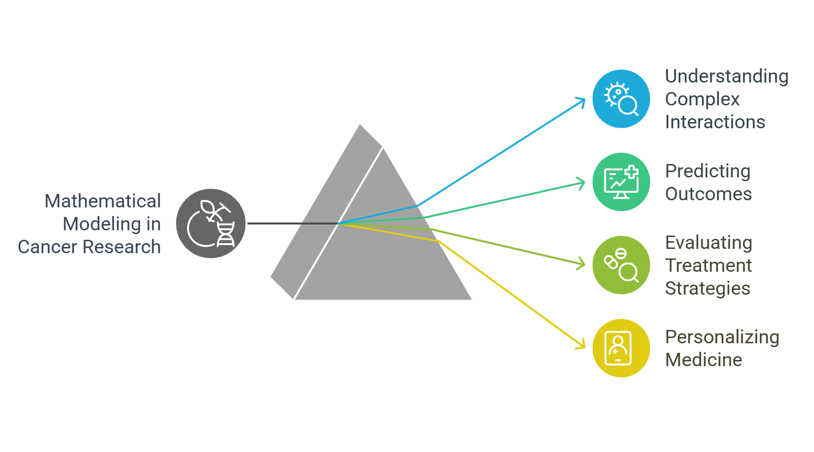

# Introduction

---

## Why Cancer?

{ .center width=500 }

Worldwide, cancer is a main cause of disease and death. By 2020, doctors found about 19 million newly occurring cancer cases. This number shows the significant influence the sickness has on families, people, and medical systems.

Biologically, cancer comes from cells multiplying too rapidly without regard to the body's regular signals, which produces tumors and promotes metastasis. Variations in therapeutic access, socioeconomic status, and public awareness improve this biological complexity and so make cancer a worldwide issue.

Cancer has huge social repercussions. Beyond its physical effects, cancer influences mental well-being and society structures. Families find financial trouble from treatment costs; but, patients and caregivers usually carry a significant emotional weight. Dealing with this issue demands a comprehensive strategy that enhances treatment methods in addition to expanding prevention programs.

## Why Math Modeling?

{ .center width=700 }

Mathematical modeling is now absolutely essential for developing reasonable treatment strategies and knowledge of cancer dynamics. Models of biological events enable researchers to grasp the complex interactions of cancer cells, the immune system, and therapy medications. These models enable researchers to project results, theorize, and investigate in ways not feasible with merely experimental methods.

In cancer research, mathematical modeling is important for providing a structure for evaluating many scenarios and treatment approaches as well as for basic predictions. In this age, personalized medicine is becoming more and more important; hence, models can assist to adjust treatments to unique patient profiles and indicate which therapies are most likely to be successful.

## Applications

{ .center width=400 }

Among the most fascinating routes of mathematical modeling in cancer research is the investigation of tumor-immune interactions. Tumors can create plans to evade the immune system, a condition that complicates treatment and promotes cancer progression. By modeling these dynamics, researchers might explore the interactions among several immune cell types, assess the efficacy of immunotherapies, and develop strategies to enhance immune responses against cancer.

Moreover, using these models helps researchers to duplicate the effects of treatments including customized therapy, immunotherapy, and chemotherapy. This approach clarifies which pairs of therapies yield the best outcomes, hence optimizing therapy programs.

---

## Key Focus:

**ODE-Based Modeling of Tumor Growth, Immune Response, and Chemotherapy Control**

Cancer modeling makes extensive use of ordinary differential equations (ODEs). ODE-based modeling allows researchers to numerically depict over time the rates of change in tumor cell and immune cell populations. By constructing systems of differential equations that capture the dynamics of tumor development, the responsiveness of various immune cells, and the impacts of chemotherapy, researchers can study several scenarios.

1. **Tumor Growth:**  
   ODEs can show the spread of cancer cells considering aspects such as nutrition availability, space, and the tumor microenvironment. Customization of models allows them to display several tumor types and growth patterns.

2. **Immune Response:**  
   The interaction of cancer cells with the immune system shapes tumor formation and responsiveness to treatment significantly. ODE-based models help one to grasp how malignancies could elude immune recognition by letting one monitor the activation and control of immune cells.

3. **Chemotherapy Control:**  
   Including the effects of chemotherapy into these models lets scientists duplicate numerous dosage regimes and treatment intensities. This helps to analyze medication efficacy and identify possible resistance mechanisms.

---

All things considered, cancer is a huge medical and social issue harming millions of individuals globally. Mathematical modeling—especially with ODEs—offers a great means to simplify the complexity of tumor-immune interactions and enhance therapeutic strategies.

These models help us advance our understanding of cancer and move us closer to overcoming this main challenge in modern medicine, hence improving patient outcomes. Clinical research, mathematics, and biology taken together have significant potential to revolutionize cancer treatment for coming generations.

## _References_:

---
