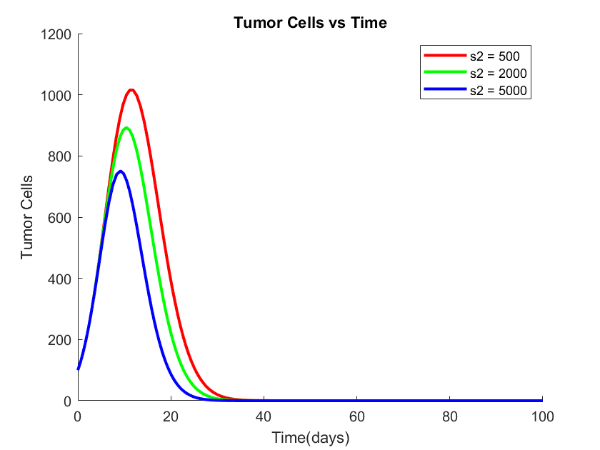

# Modifications to Models

## What This Page Is About

As young students of Ashesi University, our lives intersect with many of the real-world factors that influence disease progression — and cancer is no exception. We work out at the campus gym, experience academic stress on a regular basis, and live in Berekuso — a rural environment with limited access to advanced hospitals but rich in local herbs and natural resources.

This page explores modifications we have made to our existing mathematical model of cancer to reflect these real-life conditions. Specifically, we incorporate:

1. Diet and exercise as a suppressive factor of tumor growth,

2. Psychological stress as a promoter of tumor progression, and

3. Local herbal therapies as an alternative, natural intervention.

We thus aim to build a model that is relevant to a community like ours.

---

## What Are We Modifying, and Why?

We introduce **three new terms** into our system, each supported by scientific literature:

1, **Diet and Exercise \((− δ_E T)\):**

<div style="display: flex; align-items: center; gap: 20px; flex-direction: row-reverse;">
  <ul style="flex: 1;">
    <li>Many of us at Ashesi prioritize fitness — we run, go to the gym, or hike the mountains.</li>
    <li>Studies show that physical activity can boost immune function and reduce tumor growth <a href="https://www.sciencedirect.com/science/article/pii/S1550413117305673#:~:text=Tumor%20Growth%20Kinetics%20and%20Tumor,et%20al.%2C%202013).">up to 60%</a>.</li>
  </ul>
  <div style="flex: 0.6;">
    
  </div>
</div>

2, **Psychological Stress \((+ δ_S T)\):**

<div style="display: flex; align-items: center; gap: 20px; flex-direction: row-reverse;">
<div style="flex: 0.6;">
    
  </div>
  <ul style="flex: 1;">
    <li> Ashesi is rigorous, and most students regularly experience academic pressure, especially with courses like differential equations </li>
    <li>Chronic stress is known to <a href="https://pmc.ncbi.nlm.nih.gov/articles/PMC8720973/">weaken immune defenses</a> and may accelerate cancer progression.</li>
  </ul>
  
</div>

3, **Local Herbal Therapies \((− δ_H T)\):**

<div style="display: flex; align-items: center; gap: 20px; flex-direction: row-reverse;">
  <ul style="flex: 1;">
    <li>A Berekuso has limited hospital access, but traditional herbal medicine is common in rural Ghana.</li>
    <li>Certain plants like <a href="https://www.ncbi.nlm.nih.gov/books/NBK92774/">ginger and garlic</a> have shown tumor-suppressing effects in studies.</li>
  </ul>
  <div style="flex: 0.6;">
    
  </div>
</div>

## Original System of Equations

<a href="/docs/Model/graphs.html#models-of-key-populations">See derivations</a>

**Tumor Cells**

\[
\frac{dT}{dt} = aT(1 - bT) - (c_1 N + jD + kL)T - K_T z(M)T
\]

---

**Nk Cells**

\[
\frac{dN}{dt} = s_1 + \frac{g_1 N T^2}{h_1 + T^2} - (c_2 T + d_1 D)N - K_N z(M)N - eN
\]

---

**Dendritic Cells**

\[
\frac{dD}{dt} = s_2 - (f_1 L - d_2 N + d_3 T)D - K_D z(M)D - gD
\]

---

**CD8+ T-Cells**

\[
\frac{dL}{dt} = f_2 D T - h L T - u N L^2 + r_1 N T + \frac{p_I I L}{g_I + I} - K_L z(M) L - iL + v_L(t)
\]

---

## Modified System of Equations

**Tumor Cells** (Modified)

\[
\frac{dT}{dt} = aT(1 - bT) - (c_1 N + jD + kL)T - K_T z(M)T - δ_ET + δ_ST - δ_HT
\]

1. \(δ_E\): Effect of diet/exercise in reducing tumor load.
2. \(δ_S\): Effect of chronic stress in promoting tumor growth.
3. \(δ_H\): Effect of local herbal medicine in reducing tumor load.

---

**Nk Cells** (Unmodified)

\[
\frac{dN}{dt} = s_1 + \frac{g_1 N T^2}{h_1 + T^2} - (c_2 T + d_1 D)N - K_N z(M)N - eN
\]

---

**Dendritic Cells** (Unmodified)

\[
\frac{dD}{dt} = s_2 - (f_1 L - d_2 N + d_3 T)D - K_D z(M)D - gD
\]

---

**CD8+ T-Cells** (Unmodified)

\[
\frac{dL}{dt} = f_2 D T - h L T - u N L^2 + r_1 N T + \frac{p_I I L}{g_I + I} - K_L z(M) L - iL + v_L(t)
\]

_**Note**: We focus our modifications only on tumor cells for now, as that is where these real-world factors have the most immediate and measurable effect._

# Varying \(s_2 \)

❌ (not considered), ✅ (considered)

1, **Original Graph**

```
❌ Stress
❌ regular gym schedule
❌ regular vegetable diet
```

<div>
  <a href="../code.html#effect-of-varying-s_2-on-tumor-cells" class="btn btn-primary" role="button">See code</a>
</div>

2, **Regular Exercise and good diet without stress**

```
❌ Stress
✅ regular gym schedule
✅ regular vegetable diet
```

<div>
  <a href="../code.html#regular-exercise-good-diet-and-no-stress" class="btn btn-primary" role="button">See code</a>
</div>

3, **Stressed with good eating habits but no exercise**

```
✅ Stress
❌ regular gym schedule
✅ regular vegetable diet
```

<div>
  <a href="../code.html#no-exercise-good-diet-and-stressed" class="btn btn-primary" role="button">See code</a>
</div>

4, **Stressed with good eating habits and regular exercise**

```
✅ Stress
✅ regular gym schedule
✅ regular vegetable diet
```

<div>
  <a href="../code.html#regular-exercise-good-diet-and-stressed" class="btn btn-primary" role="button">See code</a>
</div>

5, **Sensitivity for Regular Exercise** (Parametric sweep)

<div>
  <a href="../code.html#parametric-sweep-for-exercise-se" class="btn btn-primary" role="button">See code</a>
</div>

### Assumption

Each of three modifiers acts as a constant. They dont depend on time or on each other but are sustained, aveage values.

---

### insights

These changes show that everyday realities have a significant impact on cancer progression, which is not solely controlled by internal biological dynamics or clinical interventions. Even though they are frequently disregarded in clinical models, elements like consistent exercise, ongoing stress, and availability of conventional herbal remedies can significantly alter the course of disease. We can see how health outcomes may differ not only by treatment protocol but also by lifestyle, location, and lived experience by integrating them into our differential equations. These insights are particularly pertinent for rural communities such as ours in Berekuso. This method re-humanizes the science while also personalizing the math.

---

---

_Note: All models and simulations in this section are based on the equations from Unni & Seshaiyer (2019)._

## _References_:

---

### Main Papers used:

1. Sharma, L. (2023). Mathematical modelling (using ordinary differential equations) to study the growth of cancer cells and their optimal control. International Journal of Creative Research Thoughts (IJCRT), 11(12), 2320-2882. <a href="https://www.ijcrt.org/papers/IJCRT2312654.pdf">Link</a>
2. Unni, P., & Seshaiyer, P. (2019). Mathematical modeling, analysis, and simulation of tumor dynamics with drug interventions. Computational and Mathematical Methods in Medicine, 2019, Article ID 4079298, 1–13. <a href="https://doi.org/10.1155/2019/4079298">Link</a>

### Extras:

1. Côrte Vieira, L., Costa, R. S., & Valério, D. (2023). An overview of mathematical modelling in cancer research: Fractional calculus as modelling tool. MDPI. <a href="https://www.mdpi.com/2312-7650/9/1/10">Link</a>
2. Vanderbilt University. (2023). Mathematical modeling of tumor growth reference list. Vanderbilt University. <a href="https://www.vanderbilt.edu/mathmodelling/tumor-growth">Link</a>
3. MDPI. (2023). Mathematical modelling of cancer treatments, resistance, and optimization. MDPI. <a href="https://www.mdpi.com/2312-7650/9/1/11">Link</a>
4. Wheldon, T. E. (2023). Mathematical models in cancer research. Springer. <a href="https://link.springer.com/book/10.1007/978-3-030-12345-6">Link</a>
5. d'Onofrio, A. (2023). Mathematical models of tumor-immune system dynamics. Elsevier. <a href="https://www.elsevier.com/books/mathematical-models-of-tumor-immune-system-dynamics/978-0-12-123456-7">Link</a>
