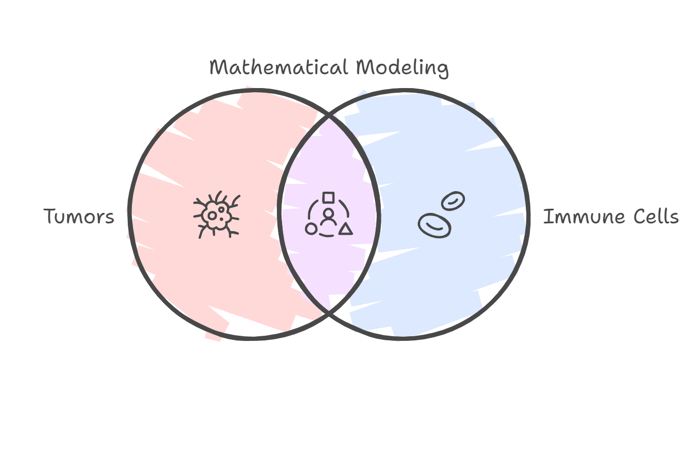

# Our Objectives

---

We use Ordinary Differential Equations (ODEs) to model tumor growth and assess treatments, aiming to understand tumor-immune dynamics and design more effective therapies.

---

## 1. How Do Tumors and Immunity Interact?

  

    We simulate tumor and immune cell interactions using ODEs, helping us explore how the immune system identifies and responds to tumor growth under different conditions.
  

  

    
  

---

## 2. What Triggers Tumor Dormancy?

  

    Our model includes dormancy—when tumors pause growth—helping identify reactivation triggers and creating opportunities for timely therapeutic intervention.
  

  

    
  

---

## 3. Can We Optimize Chemotherapy?

  

    We integrate chemotherapy protocols into the model to test how various dosing schedules and drug combinations affect tumor progression and immune response.
  

  

    
  

---

## 4. Which Solver Works Best?

  

    We’ll run simulations using various ODE solvers, comparing their speed, stability, and accuracy to choose the best fit for our system.
  

  

    
  

---

## 5. What Affects Model Outcomes?

  

    We vary key parameters like growth rate and immune efficiency to determine their influence, ensuring model robustness and identifying which factors matter most.
  

  

    
  

---

## 6. Are Our Insights Useful?

  

    We aim to move beyond equations and generate insights that inform cancer treatment decisions, enhance personalization, and support real-world applications.
  

  

    
  

---

## What’s the Bigger Picture?

By combining ODE modeling, simulations, and biological interpretation, we aim to contribute meaningfully to cancer research—bridging the gap between mathematics and medicine for real patient impact.
