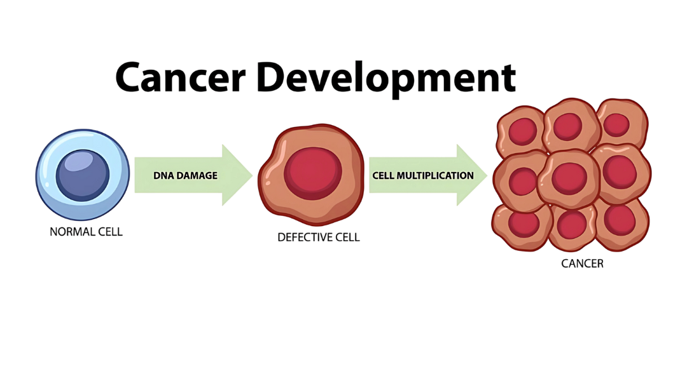
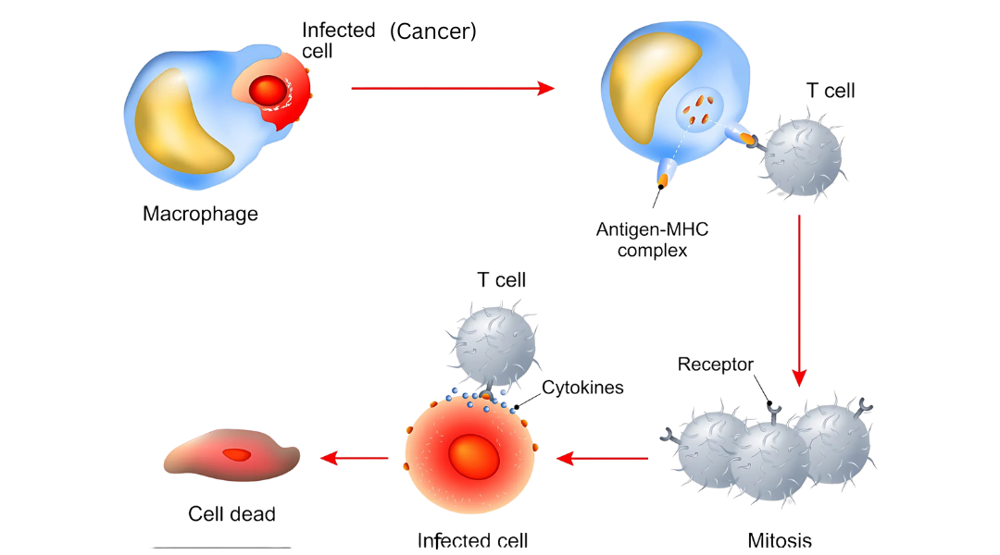

# Tumor Dynamics

---

Advancement in cancer treatments depends on knowledge of how tumors develop and interact with the immune system. A condensed summary of these basic dynamics is provided below, with an emphasis on tumor formation, immune responses, and the critical links that guide treatment decisions.

---

## 1. What Are Tumors?

Uncontrolled cell divisions produce abnormal clumps of tissue called tumors. They can be benign (non-spreading) or malignant (capable of invading tissues and metastasizing).

Tumor growth occurs when cell cycle regulation fails—like when checkpoint mechanisms or programmed cell death pathways are disrupted. Genetic mutations often allow cancer cells to override these systems, grow rapidly, and form tumors.

---

## 2. What Does the Immune System Do?

The immune system fights off viruses and abnormal cells—including cancer cells. **T-lymphocytes (T-cells)** detect and destroy tumor cells. Macrophages, which consume pathogens and waste, also coordinate immune signaling.

As tumors grow, they emit signals that attract immune cells, sparking a defensive response. But whether the immune system succeeds depends on the tumor’s tactics and the immune response's strength.

---

## 3. How Do Tumors Evade Immunity?

Immune surveillance is the body’s constant scanning for abnormal cells. T-cells often kill these cells early. But some cancer cells escape detection using clever tactics—like suppressing immune responses or changing surface proteins.

These evasive strategies make cancer harder to treat and highlight the importance of therapies that boost immune recognition.

---

## 4. What Populations Matter in our Modeling?

To simulate tumor-immune dynamics, three main populations are modeled:

1. **Tumor Cells**: Fast-growing, mutation-prone, often resistant.

2. **Immune Cells**: T-cells attack; macrophages aid and signal.

3. **Drug Concentration**: Treatments like chemo or immunotherapy affect both tumor and immune responses depending on dosage and timing.

---

## 5. What’s the Takeaway?

The relationship between tumor development and immune response is deeply interconnected. Understanding how tumors grow, evade detection, and respond to treatments allows researchers to design better therapeutic strategies.

Mathematical modeling turns this knowledge into predictive tools, driving progress in personalized, effective cancer therapies. Every insight helps us edge closer to transformative cancer care.

---
